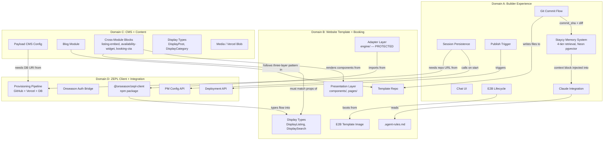
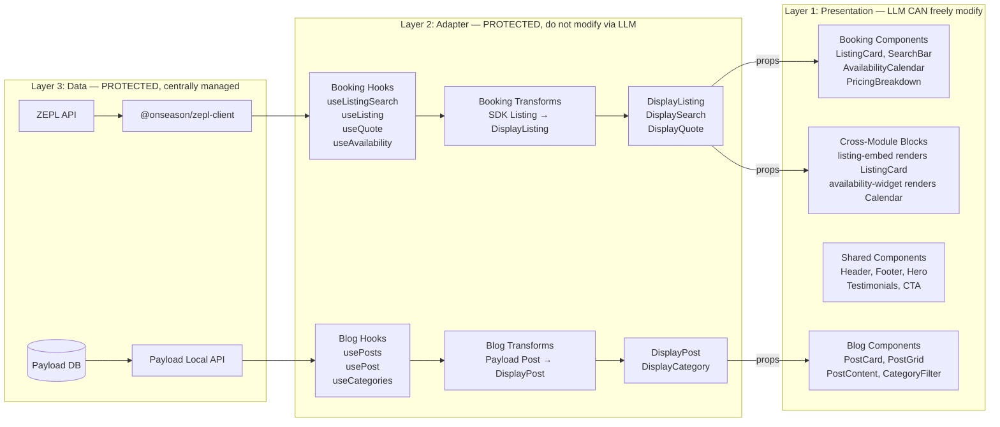
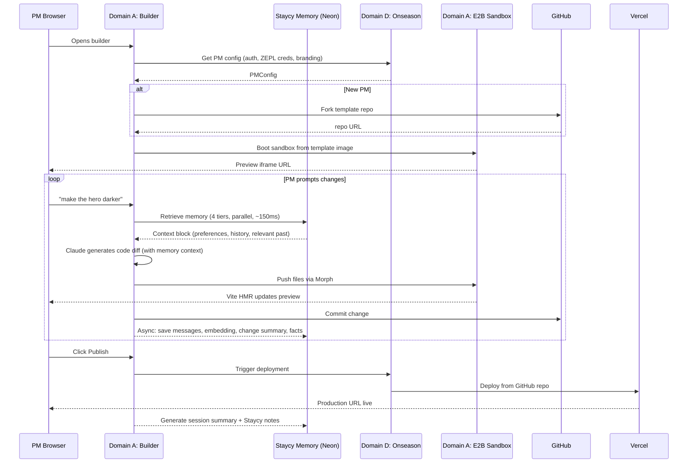

# AI Website Builder for Property Managers — Full Project Context

> **Purpose:** This is the comprehensive shared context for AI agents working on this project. Every team member feeds this to their LLM tools so that all AI-generated code is consistent, architecturally correct, and respects domain boundaries. The Coherence Manager (Eddy) keeps this document current.
>
> **Last updated:** April 7, 2026 | **Version:** 1.0

---

## 1. What We're Building

An AI-powered website generation platform for property managers (PMs). A PM signs up in our existing dashboard (Onseason), connects their property management system (PMS), and gets a fully functional direct-booking website. They customize it through natural language prompts in a chat interface and see changes in real-time. The site comes pre-built with a booking engine, blog CMS, and marketing pages.

### Core User Flow

1. PM logs into Onseason, has PMS connected via ZEPL
2. PM opens the AI website builder (a Fragments-based chat + preview UI)
3. For new PMs: a fresh site boots from our default template with their branding and ZEPL data
4. For returning PMs: their existing site loads from their GitHub repo
5. PM prompts changes ("make the hero darker", "add a testimonials section", "write a blog post about local restaurants")
6. Claude generates code diffs, files are pushed to an E2B sandbox, Vite HMR updates the live preview in ~5-10 seconds
7. Every change is a git commit in the PM's GitHub repo
8. PM clicks "Publish" when ready -> Vercel production deployment

### What This is NOT

- Not a general-purpose website builder — it's vertical, opinionated, property-management-focused
- Not a replacement for Onseason — it extends Onseason with a guest-facing booking channel
- Not a rebuild of ZEPL — we consume ZEPL's unified API, we don't replicate PMS logic

---

## 2. Existing Ecosystem (Already Built)

### Onseason
Our dashboard product where PMs register, connect their PMS providers, manage reservations, and process payments. For this project, Onseason is:
- The **auth source** — PMs log in via Onseason credentials
- The **config source** — PM's ZEPL credentials, branding preferences, feature flags
- The **reservation handler** — checkout/payment flows route through Onseason

### ZEPL
Our OTA backend system. ZEPL connects to PMS providers (Guesty, Hostaway, Beds24, Lodgify, etc.), syncs listings, and provides a **unified REST API** for:
- `GET /search` — search listings with filters
- `GET /listing/:id` — single listing with full details
- `GET /availability/:id` — calendar and blocked dates
- `POST /quote` — itemized pricing for dates/guests
- `POST /reservation` — create a booking (coordinated with Onseason for payment)

**Critical:** ZEPL already handles all PMS normalization. The generated websites never talk to Guesty/Hostaway/etc. directly — they only talk to ZEPL.

---

## 3. High-Level Architecture

```
+---------------------------------------------+
|  PM's Browser                               |
|  +-- Chat pane (prompts + AI responses)     |
|  +-- Preview iframe (E2B sandbox URL)       |
|  +-- Publish button                         |
+--------------+------------------------------+
               |
+--------------v------------------------------+
|  Fragments Fork (Builder UI + Orchestrator) |
|  Next.js 14 app, single deployment          |
|  +-- Vercel AI SDK (streaming)              |
|  +-- Claude Sonnet (code generation)        |
|  +-- Morph (token-efficient code apply)     |
|  +-- Staycy Memory (4-tier, Neon pgvector)  |
|  +-- E2B SDK (sandbox lifecycle)            |
|  +-- GitHub API (commits, repo management)  |
|  +-- Vercel API (deploy on publish)         |
+--------------+------------------------------+
               |
    +----------+----------+--------------+-----------+
    v          v          v              v           v
+--------+ +-------+ +--------+  +------------+ +--------+
|  E2B   | |GitHub | |Vercel  |  |  Onseason  | | Neon   |
|Sandbox | |(repo  | |(prod   |  |  (auth,    | |(shared |
|(preview| |per PM)| |deploy) |  |   config)  | | builder|
| ~150ms)| |       | |        |  |            | | memory)|
+---+----+ +-------+ +--------+  +------------+ +--------+
    |
    v
+---------------------------------------------+
|  Generated PM Website (Next.js 15 app)      |
|  +-- Booking module -> ZEPL API             |
|  +-- Blog module -> Payload CMS (embedded)  |
|  +-- Marketing pages                        |
|  +-- @onseason/zepl-client (npm package)    |
+---------------------------------------------+
```

---

## 4. Architecture Relationship Graphs

These diagrams show how domains, layers, and data flow connect. Navigate by relationship, not by search.

### Domain Dependency Graph



### Three-Layer Data Flow



### PM Session Lifecycle



---

## 5. Three-Layer Template Architecture

**This is the most important architectural rule.** Every feature module follows three layers with strict boundaries:

### Layer 1: Presentation (LLM CAN freely modify)
- Location: `src/modules/*/components/`, `src/modules/*/pages/`
- Contains: React components, JSX, Tailwind classes, layouts, animations
- Components receive **Display types** as props (e.g., `DisplayListing`, `DisplayPost`)

### Layer 2: Adapter (PROTECTED — do not modify via LLM)
- Location: `src/modules/*/engine/`
- Contains: React hooks (`useListingSearch`, `useListing`, `usePosts`), transform functions, Display type definitions
- Transforms raw API/SDK data into stable Display types
- This layer is the **contract** between presentation and data

### Layer 3: Data (PROTECTED — centrally managed)
- `@onseason/zepl-client` npm package (booking data from ZEPL)
- Payload CMS local API (blog content from database)
- Updated centrally -> all customer sites inherit on version bump

### Why This Matters
- The LLM can completely redesign how a listing card looks without risking the API call that fetches the listing data
- When ZEPL adds a new field, we update the SDK + transforms once, and all sites get it
- The Display types are the stable interface — `DisplayListing.petFriendly` is always a boolean regardless of how ZEPL's raw API represents it

---

## 6. Template File Structure

```
booking-site-template/
+-- src/
|   +-- modules/
|   |   +-- booking/                         # Booking engine module
|   |   |   +-- engine/                      # PROTECTED
|   |   |   |   +-- hooks/
|   |   |   |   |   +-- useListingSearch.ts  # Calls ZEPL search
|   |   |   |   |   +-- useListing.ts        # Calls ZEPL get by ID
|   |   |   |   |   +-- useQuote.ts          # Calls ZEPL quote API
|   |   |   |   |   +-- useAvailability.ts   # Calls ZEPL availability
|   |   |   |   +-- transforms/
|   |   |   |   |   +-- listing.ts           # SDK Listing -> DisplayListing
|   |   |   |   |   +-- reservation.ts       # Form state -> ReservationRequest
|   |   |   |   +-- types.ts                 # DisplayListing, DisplaySearch, etc.
|   |   |   +-- components/                  # LLM CAN MODIFY
|   |   |   |   +-- ListingCard.tsx
|   |   |   |   +-- ListingGrid.tsx
|   |   |   |   +-- SearchBar.tsx
|   |   |   |   +-- SearchFilters.tsx
|   |   |   |   +-- AvailabilityCalendar.tsx
|   |   |   |   +-- PricingBreakdown.tsx
|   |   |   |   +-- ReservationForm.tsx
|   |   |   |   +-- GalleryViewer.tsx
|   |   |   |   +-- ReviewsList.tsx
|   |   |   +-- pages/
|   |   |       +-- SearchPage.tsx
|   |   |       +-- ListingDetailPage.tsx
|   |   |       +-- CheckoutPage.tsx
|   |   |
|   |   +-- blog/                            # Blog CMS module
|   |       +-- engine/                      # PROTECTED
|   |       |   +-- hooks/
|   |       |   |   +-- usePosts.ts
|   |       |   |   +-- usePost.ts
|   |       |   |   +-- useCategories.ts
|   |       |   +-- transforms/
|   |       |   |   +-- post.ts              # Payload Post -> DisplayPost
|   |       |   +-- types.ts                 # DisplayPost, DisplayCategory
|   |       |   +-- blocks/                  # Cross-module block definitions
|   |       |       +-- listing-embed.ts     # Embeds ListingCard in blog posts
|   |       |       +-- availability-widget.ts
|   |       |       +-- booking-cta.ts
|   |       +-- components/                  # LLM CAN MODIFY
|   |       |   +-- PostCard.tsx
|   |       |   +-- PostGrid.tsx
|   |       |   +-- PostContent.tsx
|   |       |   +-- PostHeader.tsx
|   |       |   +-- CategoryFilter.tsx
|   |       |   +-- NewsletterSignup.tsx
|   |       +-- pages/
|   |           +-- BlogIndexPage.tsx
|   |           +-- BlogPostPage.tsx
|   |
|   +-- components/                          # Shared components (LLM CAN MODIFY)
|   |   +-- layout/
|   |   |   +-- Header.tsx
|   |   |   +-- Footer.tsx
|   |   |   +-- Navigation.tsx
|   |   +-- marketing/
|   |       +-- Hero.tsx
|   |       +-- Testimonials.tsx
|   |       +-- Features.tsx
|   |       +-- CallToAction.tsx
|   |
|   +-- app/                                 # Next.js App Router pages
|   |   +-- page.tsx                         # Homepage
|   |   +-- search/page.tsx
|   |   +-- listing/[id]/page.tsx
|   |   +-- checkout/page.tsx
|   |   +-- confirmation/page.tsx
|   |   +-- blog/page.tsx
|   |   +-- blog/[slug]/page.tsx
|   |   +-- (admin)/admin/[[...segments]]/page.tsx  # Payload admin
|   |
|   +-- styles/
|       +-- globals.css
|
+-- payload.config.ts                        # PROTECTED — Payload CMS config
+-- site.config.json                         # Per-customer config
+-- .agent-rules.md                          # LLM agent boundary rules
+-- tailwind.config.ts                       # LLM CAN MODIFY (theming)
+-- next.config.ts
+-- package.json                             # Depends on @onseason/zepl-client
+-- tsconfig.json
```

---

## 7. Display Type Interfaces (Props Contracts)

These are the stable interfaces that presentation components consume. Defined in each module's `engine/types.ts`.

### DisplayListing (booking module)
```typescript
interface DisplayListing {
  id: string;
  title: string;
  subtitle: string;              // e.g., "Villa in Dubrovnik"
  heroImage: string;
  galleryImages: string[];
  pricePerNight: string;         // formatted with currency
  priceTotal?: string;
  rating: number;
  reviewCount: number;
  location: {
    city: string;
    region: string;
    country: string;
    coordinates: { lat: number; lng: number };
  };
  highlights: string[];          // top amenities, max 5
  allAmenities: string[];
  beds: string;                  // "3 bedrooms · 2 bathrooms"
  maxGuests: number;
  petFriendly?: boolean;
  petPolicyText?: string;
}
```

### DisplayPost (blog module)
```typescript
interface DisplayPost {
  slug: string;
  title: string;
  excerpt: string;
  coverImage: string;
  publishedAt: string;           // formatted date
  readingTime: string;           // "5 min read"
  author: {
    name: string;
    avatar?: string;
  };
  category: string;
  tags: string[];
  content: any;                  // Payload rich text (rendered by PostContent component)
}
```

### DisplayCategory (blog module)
```typescript
interface DisplayCategory {
  slug: string;
  name: string;
  postCount: number;
}
```

New optional fields may be added over time. Existing components won't break because new fields are always optional.

---

## 8. Per-Customer Configuration

Each customer site has a `site.config.json`:

```json
{
  "engine": {
    "provider": "zepl",
    "apiBase": "https://api.zepl.io",
    "credentials": "ENV:ZEPL_API_KEY"
  },
  "cms": {
    "provider": "payload",
    "databaseUri": "ENV:DATABASE_URI",
    "mediaStorage": "vercel-blob"
  },
  "branding": {
    "name": "Adriatic Luxury Villas",
    "primaryColor": "#1a365d",
    "logo": "/logo.svg"
  },
  "features": {
    "booking": {
      "enabled": true,
      "search": true,
      "checkout": true,
      "reviews": true
    },
    "blog": {
      "enabled": true,
      "categories": true,
      "newsletter": false,
      "relatedListings": true
    },
    "contact": {
      "enabled": true
    }
  }
}
```

Feature flags control which modules are active. Disabled modules have their routes and nav links excluded.

---

## 9. Session Persistence + Staycy Memory System

E2B sandboxes are **ephemeral** — killed when the PM closes the tab or goes idle. Persistence has **two layers**: GitHub for code state, and the Staycy memory system for conversational intelligence.

### Code Persistence (GitHub)

**New PM (first visit):**
1. Fork template repo -> `onseason-sites/[pm-name]`
2. Boot E2B sandbox from custom template image
3. Inject PM config (ZEPL credentials, branding from Onseason)
4. PM prompts -> changes committed to new repo

**Returning PM:**
1. Boot E2B sandbox, clone PM's repo from GitHub
2. `bun install` (fast — deps mostly cached in template image)
3. Vite starts -> preview shows their site as they left it
4. PM continues prompting -> new commits to same repo

**Publish Flow:**
PM clicks "Publish" -> Vercel deployment triggered from GitHub repo -> production URL live in ~20-30 seconds.

### Conversational Memory: Staycy

Git tracks **what changed in code**. Staycy tracks **what was said, why, and what the PM prefers**. The builder's AI assistant (Staycy) has a four-tier memory system that retrieves context before every Claude call, assembling in ~150-200ms.

```
PM sends prompt
       |
       v
+-----------------------------------------------+
|  Memory orchestrator (~150-200ms, parallel)    |
|                                                |
|  Tier 1: Working memory     (~5ms)             |
|    Last 10 messages + change summaries         |
|                                                |
|  Tier 2: Session summaries  (~10ms)            |
|    LLM-generated summaries of past sessions    |
|                                                |
|  Tier 3: Vector search      (~80-100ms)        |
|    Semantically similar past messages           |
|    via pgvector (text-embedding-3-small)        |
|                                                |
|  Tier 4: PM facts           (~10ms)            |
|    Extracted preferences, constraints, brand    |
|    + Staycy's own notes about this PM          |
+-----------------------------------------------+
       |
       v
  Context block injected into Claude system prompt
       |
       v
  Claude generates response
       |
       v (async, non-blocking)
+-----------------------------------------------+
|  Post-response pipeline:                       |
|  1. Save messages to conversations DB          |
|  2. Generate embedding for user message        |
|  3. Fetch git diff -> generate change_summary  |
|  4. Store commit_sha + files_changed + summary |
|  5. Every 5th msg: extract PM facts via LLM    |
|  6. On session end: generate session summary   |
|  7. On session end: Staycy writes self-notes   |
+-----------------------------------------------+
```

**Key design decisions:**

- **Single Neon Postgres database** with pgvector extension — no separate vector DB. All tables (conversations, messages, pm_facts) live in the shared builder project, not per-customer Payload databases.
- **Change summaries bridge conversation and code.** Git stores the diff; the memory DB stores an LLM-generated, human-readable summary of what visually/functionally changed. This is what Staycy references when the PM asks "what did we do last time?" — not raw diffs.
- **PM facts are extracted periodically** (every 5th message + session end), not every message. Each fact has a type (preference, constraint, brand, site_state, history), a confidence score, and provenance. Contradicted facts are soft-deleted and linked to their replacement.
- **Staycy's self-notes** are a special fact type where Staycy writes observations about the PM's working style after each session. Capped at 5 active notes per PM.
- **Undo via git linkage:** When a PM requests undo, Staycy queries messages for the relevant `commit_sha`, fetches the parent commit state from GitHub, and provides Claude with the before-state for generating the revert.

**Cost:** ~$0.022 per session (embedding + change summaries + fact extraction + session summary). At 100 PMs with 4 sessions/month: ~$8.80/month total.

Full implementation plan: `docs/staycy-memory-system-plan.md`

---

## 10. E2B Sandbox Setup

### Custom Template Definition
```typescript
Template()
  .fromBunImage('1.3')
  .setWorkdir('/home/user/site')
  .runCmd('git clone https://github.com/onseason/booking-site-template.git .')
  .runCmd('bun install')
  .runCmd('bunx --bun shadcn@latest add --all')
  .setStartCmd('bun --bun run dev --turbo', waitForURL('http://localhost:3000'))
```

### Registered as Fragments Persona
In `lib/templates.json`:
```json
{
  "booking-site": {
    "name": "Booking website",
    "lib": ["next", "react", "tailwindcss", "@onseason/zepl-client", "payload"],
    "file": "src/app/page.tsx",
    "instructions": "A property manager booking website with search, listings, checkout, and blog.",
    "port": 3000
  }
}
```

---

## 11. Glossary

| Term | Meaning |
|---|---|
| **PM** | Property Manager — our end user |
| **Onseason** | Our existing dashboard product (auth, reservations, payments) |
| **ZEPL** | Our OTA backend (unified PMS API for listings, search, availability, quotes) |
| **PMS** | Property Management System (Guesty, Hostaway, Beds24, etc.) — connected via ZEPL |
| **Fragments** | E2B's open-source AI code generation template (Apache 2.0, we fork it) |
| **E2B** | Cloud sandbox provider — ephemeral Linux microVMs for live preview |
| **Display types** | The stable TypeScript interfaces (DisplayListing, DisplayPost) that presentation components consume |
| **Adapter layer** | The protected middle layer (hooks + transforms) between presentation and data |
| **Three-layer architecture** | Presentation -> Adapter -> Data. LLM edits presentation only. |
| **Staycy** | The AI assistant persona PMs interact with. Has a 4-tier memory system (working memory, session summaries, vector search, PM facts) backed by Neon pgvector |
| **Change summary** | LLM-generated, human-readable description of what a git commit visually/functionally changed. Bridges conversation and code in Staycy's memory |
| **PM facts** | Extracted knowledge about a PM (preferences, constraints, brand details, site state, history). Stored in pm_facts table with confidence scores and provenance |
| **Coherence Manager** | Team role (Eddy) — watches for drift across domains, maintains shared context |
| **Domain owner** | Team member responsible for an outcome domain end to end |
